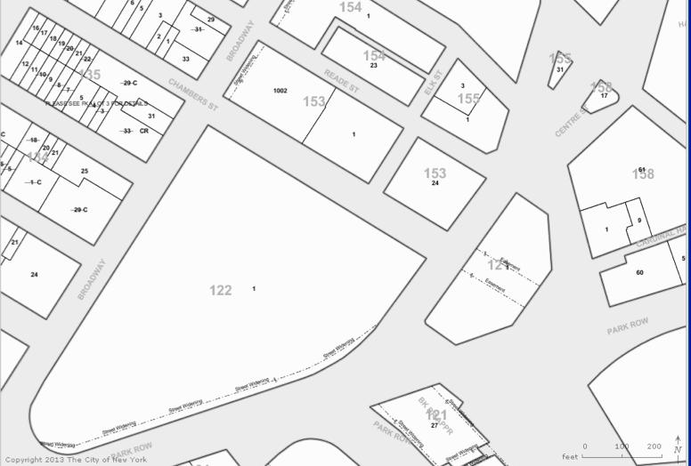

<h2>VI.2  Tax Lots and BBLs</h2>

The city’s tax geography is designated and modified by the New York City Department of Finance (DOF).  The tax geography consists of the subdivision of the territory of the city (excluding city-owned land that is mapped for streets) into <u>tax blocks</u>, each of which is further subdivided into one or more <u>tax lots</u>.

*	Each tax block is identified, uniquely within its borough, by a tax block number assigned by DOF. Each tax block can consist of one, more than one, or a portion of one physical city block.

*	Each tax lot is identified, uniquely within its tax block, by a tax lot number assigned by DOF.  

Thus, each of the city’s tax lots is identified, uniquely within the entire city, by the combination of three items, the borough code, tax block number and tax lot number.  These items are often concatenated to form a single data item called the Borough-Block-and-Lot (BBL).

DOF strives to keep the tax block numbering as stable as possible over time, to facilitate property title searches and other historical record-keeping.  For example, when a new stretch of street divides what was a single physical block into two physical blocks, DOF generally retains the old tax block number for both of the new physical blocks.  As a result, there are many tax blocks that consist of more than one physical block.  Occasionally, DOF does subdivide a tax block into two or more new tax blocks, assigning new tax block numbers to them.  This may be done when a large area of land is being developed, often in conjunction with the mapping of a new pattern of streets.  In recent years, this has most commonly occurred in Staten Island.  

In contrast to the relatively stable tax block geography, the tax lot geography is quite volatile.  DOF
constantly merges and ‘apportions’ (subdivides) tax lots, generally assigning new tax lot numbers to the newly created tax lots.  However, DOF sometimes reassigns the tax lot number of a ‘predecessor’ lot (one of the lots that is being merged or apportioned out of existence) to a ‘successor’ lot.  As a result, it is possible for the same BBL value to refer simultaneously to an existing tax lot and to one or more tax lots that no longer exist.

Figure VI-1, below, illustrates the tax geography for a portion of Manhattan in the vicinity of City Hall.
  

 Figure VI-1:  Tax Geography for a Portion of Manhattan 
  

The large numbers in Figure VI-1 are tax block numbers, and the small numbers are tax lot numbers.  Notice that tax block 153  is a case of a tax block consisting of two physical blocks.  Also notice that tax blocks 154 and 155  both have a tax lot 1, exemplifying that tax lot numbers are unique only **within a tax block**.  (Similarly, tax block numbers are unique only within a borough.)
