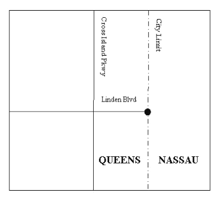
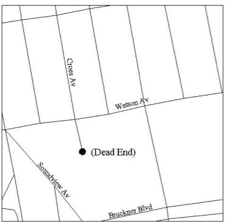
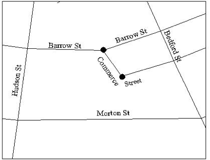
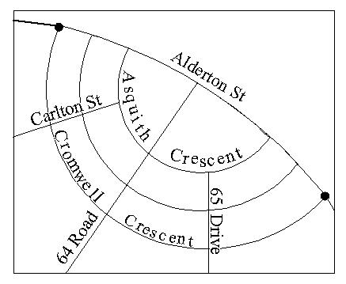
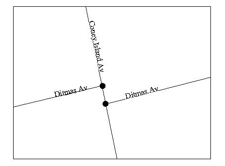
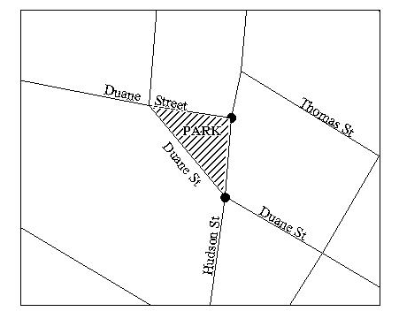
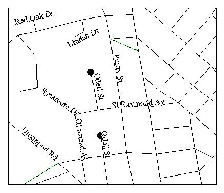
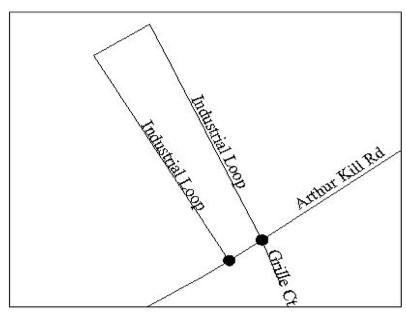
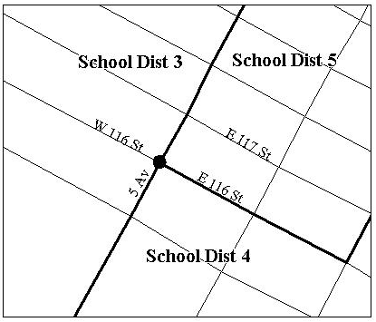
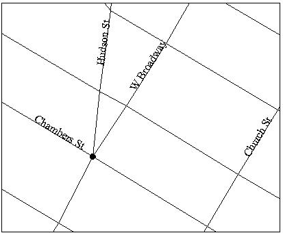

<h2>VII.2  Intersections:  Function 2 and Function 2W </h2>

Note that any references to Function 2 apply to Function 2W as well, unless specifically stated otherwise.  Note also that Function 2W is a COW-only function.

Function 2 is the Geosupport function that processes street intersections.  Function 2 can process not only conventional street intersections, but also node IDs (COW only), intersection names and ‘pseudo-intersections’, that is, intersections of a conventional street with a pseudo-street ([see Chapter III.6](../../chapterIII/section06/)).  There are three types of pseudo-intersections:  dead ends, points at which a street intersects with the city limits, and bending points of streets.  A point is considered a bending point if the angle of the street at that point is not within the range 160-200 degrees (i.e., not within 20 degrees of a straight line).  

## <u>Nodes</u>

We use the term <u>node</u> generically to refer to all types of intersections, both conventional and pseudo.  Each node is assigned a unique node ID.  Nodes, defined via street names and street codes, can serve not only as Function 2 input, but also as the delimiting endpoints of street stretches for input to the functions that process three-street configurations.  Node IDs can serve as input only to a COW Function 2 or Function 2W call.    

Formally, a node is a point along a street where one of the following occurs:  

 Figure VII-2: City Limit Point 
  

<!-- // -->

* <u>Conventional intersection of two streets: </u> The street intersects with at least one other street (called a cross street).  Example: ‘the intersection of BROADWAY and CHAMBERS STREET in Manhattan’  
 
* <u>City Limit Point:</u> The street (or non-street feature e.g. bridge or tunnel) intersects with the city limits.  (The street may terminate at that point or it may continue as a suburban street).  City Limit points occur at the Bronx-Westchester County border,  the Queens-Nassau County border, the New York-New Jersey border and the Staten Island –New Jersey border.
The New Jersey borders occur in the Hudson River, for 
example  HOLLAND TUNNEL and CITY LIMIT in 
Manhattan.  An example of Queens city limit is (see 
Figure VII-2): ‘LINDEN BOULEVARD at the CITY LIMITS in Queens’

 Figure VII-3: Dead End 
  

* <u> Dead End:</u>  The street has a termination point (called a dead end) that is not at the city limits and at which there are no cross streets. Example (see Figure VII-3):  ‘DEAD END of CROES AVENUE in the Bronx’. City limit points are excluded from being treated as possible dead ends because city streets may continue across the city limits into the adjacent suburban county.)

 

Figure VII-4: Bends
  

  

* <u>Bend:</u>  The street has a bending point.  Example (see Figure VII-4): ‘BEND of COMMERCE STREET’ and ‘BEND of BARROW STREET’ in Manhattan.  Note that the bending point of Barrow is also a conventional street intersection, the intersection of Barrow and Commerce Streets. The Commerce Street bending point is not a conventional intersection, and can only be specified in terms of the pseudo-street BEND.

  

Conceptually, nodes can be characterized as those points along streets that can be specified in a form recognizable to Geosupport, that is, in the form of an intersection name, or a pair of street codes or a pair of street names that possess street codes, or a node ID (in a COW function call).   One, and only one, street of a pair may be a pseudo-street.

The allowable pseudo-streets are DEAD END and its aliases, CITY LIMITS and its aliases, and BEND and its aliases.  See [Chapter III.6](../../chapterIII/section06/) for a discussion of pseudo-street names.

<u>Number of Intersections of a Pair of Streets</u>

Given any pair of New York City streets (or a street and a pseudo-street), there are four possibilities:  

* The two streets do not intersect at all.  
* They intersect at one location (the ‘unique-node case’).  
* They intersect twice (the ‘two-node case’).  
* They intersect more than twice (the ‘many-node case’).

Function 2 can process a pair of input streets in the <u>unique-node case</u> and in the <u>two-node case</u>, but a node ID is required as input in the <u>many-node case (supported only in COW)</u>.  If the user does not know the node ID, Function 2W may be used to assist the user in determining the appropriate node ID.   For a description of this process, see the <u>Overview of Function 2 Node Enhancements</u> and the discussion of the many-node case in <u>Specifying Function 2 Input Data</u> below.  Note that aside from dead ends, bends, subway lines, highways, etc., the many-node case is rare.  There are numerous streets that have more than two dead ends, and there are numerous streets that have more than two bends.

## <u>The Two-Node Case</u>

The two-node case occurs with greater frequency than might be expected.  Some types of situations in which the two-node case occurs are the following:  

Figure VII-5: Street Intersecting   Twice with Curved Street
  

  

* A street bends or curves, causing it to intersect  with a second street at two different points.  An example in Queens is the two intersections of the curved street Cromwell Crescent with Alderton Street (see Figure VII-5).

FigureV11-6: ‘Dogleg’
  

* A street has a displacement or offset as it crosses another street (a configuration sometimes called a ‘dogleg’), so that there are two points where the two streets intersect.  An example in Brooklyn is Ditmas Avenue where it crosses Coney Island Avenue (Figure VII-6).

  

Figure VII-7: Street Fork
  

* A street forks into two branches (for example, around a traffic island, plaza or small park) such that both branches have the same street name and they both intersect with another street.  An example in Manhattan is Duane Street, which forks around a small triangular park; both branches of Duane Street intersect with Hudson Street (Figure VII-7).

  

Figure VII-8: Street With   Two Dead Ends
  

* A street has exactly two dead ends.  An example in the Bronx is Odell Street (Figure VII-8). The two pseudo-intersections of Odell Street with the pseudo-street DEAD END are considered to be an instance of the two-node case. Similarly, streets that have exactly two intersections with the city limit, and streets that have exactly two bending points, are instances of the two-node case.

  

 

  

## <u id="chapterVII.2.3">Overview of Function 2 Node Enhancements</u>

<b>(COW Only)</b>  
Node ID (Node Number) as Input  
Processing the ‘Many-Node’ Case  

  

A unique Node Number known as a node ID is assigned to each of New York City’s intersections.  Geosupport returns node IDs for many of its functions, e.g. 1/1E Extended, 1B, 2, 3, 3C, 3S.  Users in a GIS environment also have access to the node IDs via CSCL or LION.  Users can specify a node ID as input to Function 2 and get information about the intersection without specifying cross streets or an intersection name.  Geosupport also uses node IDs to allow processing of streets that intersect more than twice.

<u><b>Function 2W is available to all users</b></u>  
Function 2W returns a 4000-byte Work Area 2.  The first 200 bytes are identical to the entire Work Area 2 of regular Function 2.  Additional information appears in the remainder of the Function 2W Work Area 2, which can be used in processing streets that intersect more than twice.

<u><b>Node as Input to Function 2</b></u>  
Users have requested the ability to retrieve information about an intersection based on the intersection’s Node Number.  That capability has been added to Function 2 (and Function 2W).  Work Area 1 has a Node Number input field where the user specifies the node input.  A Node Number output field is also defined in Work Area 1 where the normalized (right-justified and zero-filled) Node Number appears.  If the user also inputs street names or street codes, they will be ignored and the Node Number input will take priority.

<u><b>Processing Two Streets that Intersect more than twice (‘Many-Node case’)</b></u>  
Users have also requested the ability to retrieve information about an intersection of two streets that intersect more than twice.  If two streets intersect more than twice for a Function 2 call, the user will now get an error message (GRC 03 Reason Code A) suggesting that the user run Function 2W to get related nodes.

The same input that is rejected above (streets that intersect more than twice) will be rejected when those streets are processed by Function 2W.  Function 2W will return an error message (GRC 03 Reason Code B) that tells the user to use a node as input – <b>However, - In Addition to GRC 03/A and an Error Message, Function 2W will <u>also</u> Return A Work Area 2 (WA2) that Contains Related Nodes and Street Codes.</b>  This is unique in Geosupport because rejected calls normally do not return information in Work Area 2.  The Function 2W WA2 will include the Node Numbers of all the nodes satisfying the input (up to 20 nodes) and a list of B7SCs of the intersecting streets at each node,

Based on the Node Numbers and the Street Codes, the user can choose which node should be processed.  The user then issues a Function 2 or 2W call with the node ID as input and that call should execute successfully.

<u><b>GBAT support of Node Input to Function 2</b></u>  
GBAT has a new option called NODE where the user specifies the location of the Node input.  When NODE is input to GBAT the GBAT statistics will not be broken down by borough since borough is not a required part of the input.  It is recommended that users not specify streets as input together with nodes for a GBAT run since none of the output statistics will be broken down by borough.

<u><b>GBAT support of Streets that Intersect more than twice</b> </u>
GBAT has a new option, called RELATEDNODES, for Function 2.  If the user requests RELATEDNODES and the streets intersect more than twice (GRC 03 Reason Code A or B) GBAT will issue a Function 2W call under the covers, and get the nodes and street codes information from WA2.  GBAT will place this information in a separate error file, viz. ERRFIL3 which the user can examine and then choose the node to be processed.  The NODE can then be used as input to a subsequent run.

In addition to the entry in ERRFIL3 (which contains the nodes and street codes list), GBAT creates a normal error entry in the standard error file (viz. ERRFILE)

Note that when a GBAT entry is rejected with GRC03 it will not be written to the GBAT output file (OUTFILE) even if it is for Function 2W which generates a WA2 in this situation.  The information is returned to the user in ERRFIL3.

<u><b>GOAT support of Streets that Intersect more than twice</b></u>  
When input streets intersect more than twice, Mainframe GOAT (CICS) and the web version of GOAT on the Web display a list of up to 20 nodes and the cross streets at these nodes, with  their street codes and street names.  The user can then more easily choose a node and reissue the GOAT call using the chosen node as input.  

## <u>Specifying Function 2 Input Data</u>  

Applications pass input to Function 2/2W by specifying either an intersection name, or two distinct streets (i.e., two streets that have different B5SCs), or a node ID (COW only) identifying the intersection.  If the input information is in the form of an <u>intersection name</u>, it may be passed in either WA1 input street name field, and the other field should preferably be left blank or it may contain any conventional street that exists at the given intersection.   If the input data are in the form of <u>two streets</u> that are an instance of the <u>two-node case</u>, an input compass direction (‘N’, ‘S’, ‘E’ or ‘W’) must also be specified.  The compass direction identifies which of the two nodes is to be processed, by specifying that node’s spatial position relative to the other one.  For example, if ‘N’ is specified as the input compass direction, then Function 2 will process the northernmost of the two nodes.  If the user knows the node ID of the intersection, this may be used as input instead of the two streets and a compass direction.  If the input information is in the form of a <u>node ID</u>, a borough code is not required and is ignored if supplied.  

<!--    -->

Figure V11-9: Simultaneous  2-Node and Unique-Node Case
  

Note that an intersection may be an instance of the two-node case when specified (with a compass direction) in
terms of a particular pair of streets, while the same intersection may be an instance of the unique-node case when specified (without a compass direction) in terms of a different pair of streets.  For example, in Staten Island, Industrial Loop and Arthur Kill Road intersect at two nodes (see Figure VII-9).  When specifying either of those nodes as an intersection of Industrial Loop and Arthur Kill Road, a compass direction is required.  However, at the northern (or alternatively, the eastern) one of those nodes, there is a third street, Grille Court.  That node can be specified, without a compass direction, as the unique intersection either of Grille Court and Industrial Loop, or of Grille Court and Arthur Kill Road.  That node could alternatively be identified by its node ID (viz. 0000890) and no street names are needed.
In some instances of the two-node case, the two nodes are ‘nearly’ (i.e., within 10 compass degrees of) due east-west of each other.  In that event, attempting to distinguish between the two nodes in terms of the compass directions north and south would be highly error-prone.  In those cases, therefore, Function 2 accepts only ‘E’ and ‘W’ as valid input compass directions.   Similarly, if the spatial relationship between the two nodes is ‘nearly’ (within 10 degrees of) due north-south, Function 2 accepts only ‘N’ and ‘S’.  

For Manhattan only, in the two-node case, Geosupport rotates the spatial relationship between the pairs of nodes 30 degrees counterclockwise before determining whether they are ‘nearly’ north-south or east-west of each other.  This comports with the widespread conventional treatment of the avenues and streets in most of Manhattan as if they were oriented due north-south and due east-west, respectively.  In reality, Manhattan’s principal street pattern lies approximately at a 30-degree clockwise rotation from the cardinal points of the compass.  For a more detailed discussion of the 30-degree rotation for Manhattan, see the entry for Segment Orientation in [Appendix 3](../../../appendices/appendix03/).  

In most instances of the two-node case, the two nodes have a pronounced ‘diagonal’ spatial relationship, that is, they are not within 10 degrees of either due north-south or due east-west of each other.  In that case, Function 2 accepts all four compass directions as valid input.  For example, either ‘N’ or ‘W’ is accepted as a specification for the northwestern intersection of Alderton Street and Cromwell Crescent (the intersection highlighted on the upper left in Figure VII-5);  either ‘S’ or ‘E’ is accepted as a specification for the southeastern (lower right) intersection of these streets.  

<u>In the two-node case, a user must supply a compass direction, with street names, to issue a successful call.  Alternatively, the user may supply a node ID instead of the street names and a compass direction.</u>  If the two nodes in the two-node-case are close together, <u>under certain conditions it may not matter which intersection is selected.</u>  For example, if a medical emergency occurred at the intersection of Reade and Elk Streets in Manhattan, when reporting the location it would not matter which of the two intersections was provided since the two intersections are separated by about 21 feet.  On the other hand, if the medical emergency is reported as having occurred at the intersection of Castle Hill Avenue and Zerega Avenue in the Bronx, a more precise compass direction is required since the two intersections are separated by about 10,631 feet or roughly two miles.

When no compass direction is supplied, the error message returned by Geosupport (GRC 02) for a two-node case includes the distance, in feet, between the two nodes.  Depending upon the circumstance, the user may make a reasoned decision as to whether the precise intersection is required or if it does not make any difference which intersection is requested.

<u>In the many-node case, a user must supply a node ID as input to issue a successful call.</u>  A node ID is accepted as input only to COW Function 2 or 2W.  If the user does not have the node ID Function 2W may be invoked to retrieve the node IDs and B7SCs that exist at the duplicate intersections.  The user may then invoke Function 2 or 2W with the node ID of his choice.  

The procedure is as follows:  

* When an <u><b>MSW Function 2 call</b></u> is issued with streets that intersect more than twice, the resulting message is:
	GRC 03 Reason Code is ‘blank’.  
<pre class="pdfPre">‘STREETS INTERSECT MORE THAN TWICE - CAN ONLY BE PROCESSED BY  COW FUNCTION CALL’</pre>  
The user can now modify his application to issue a COW Function 2 call and proceed as defined below.  Note that the Reason Code no longer contains the number of times that the streets intersect (3 through 9).  

* When a <u><b>COW Function 2 call</b></u> is issued with streets that intersect more than twice, the resulting message is:
	GRC 03 Reason Code is ‘A’.  
  <pre class="pdfPre">‘STREETS INTERSECT MORE THAN TWICE-USE FUNCTION 2W TO FIND RELATED NODES’</pre>
The user can now modify his application to issue a COW Function 2W call and proceed as follows.  

* When a <u><b>COW Function 2W call</b></u> is issued with streets that intersect more than twice, the resulting message is:
	GRC 03 Reason Code is ‘B’.  
<pre class="pdfPre">‘STREETS INTERSECT MORE THAN TWICE - USE NODE AS INPUT’</pre>  

> In addition to the error message, Function 2W also returns a Work Area 2 which contains the node IDs (up to 20 nodes) where the streets intersect and also the B7SCs of the streets at those nodes.  There can be up to 5 intersecting streets at each node, and each of those streets may have up to 4 aliases. The user can then choose a node  and issue a COW Function 2 or 2W call with that node ID as input.  The call should then be successful.  [See Appendix 13](../../../appendices/appendix13/) for the detail layout of Work Area 2 for Function 2W.

> Note: The GRC 03 message returns ‘blank’, ‘A’, or ‘B’ as the Reason Code.  It no longer returns the number of intersections (3 through 9) as the Reason Code .

## Possible Outcomes of a Function 2 or 2W Call

Table VII-2 lists possible outcomes of a Function 2 or 2W call by Geosupport Return Code (GRC).  Table VII-2 does not include standard reject conditions that are applicable to most Geosupport functions, such as an inability to normalize or recognize an input street name.  In Table VII-2, the term ‘intersection’ also encompasses pseudo-intersections.

<b><u>Table VII-2:  Possible Outcomes of a Function 2 and 2W Call</u></b>
Possible Outcomes of a Function 2 and 2W Call

<table style="width:100%">
  <tr>
    <th colspan="2">Possible Outcomes of a Function 2 and 2W Call</th>
   </tr>
  <tr>
    <th>GRC/ Reason Code</th>
     <th>Meaning</th>

   </tr>
  <tr>
    <td>00</td>
     <td>(Successful call) If the input information was in the form of an intersection name, it was recognized as a valid name of a specific intersection.  If the input information was in the form of two streets, they intersect once or twice, and if twice, an input compass direction has been supplied which is a valid descriptor for one of those intersections.  A full complement of output data is returned in the work areas.</td>
       </tr>
       <tr>
       <td>01/H</td>
       <td>(Warning) The two input streets intersect once, but the input compass direction field is non-blank.  The input compass direction field is ignored.  A full complement of output data is returned in the work areas.</td>
       </tr>
       <tr>
       <td>01/N</td>
       <td>(Warning) Both a node ID and street names or street codes were specified as input.  The node ID will be used; the street names/codes will be ignored.</td>
       </tr>
       <tr>
       <td>01/T</td>
       <td>(Warning) The input street name is ignored if an intersection name is specified along with a street name that is part of the intersection.</td>
       </tr>
       <tr>
       <td>02</td>
       <td>(Reject) The two input streets intersect twice, but the input compass direction field is blank.  A valid input compass direction value is required for these input streets.</td>
       </tr>
       <tr>
       <td>03/blank</td>
       <td>(Reject) MSW - The two input streets intersect more than twice.  MSW Function 2 calls cannot process such intersections. The Reason Code value is blank.  The message suggests that the user use a COW function call.</td>
       </tr>
       <tr>
       <td>03/A</td>
       <td>(Reject) COW - The two input streets intersect more than twice.  Function 2 calls cannot process such intersections.  The message suggests that the user issue a Function 2W call to find related nodes.</td>
       </tr>
       <tr>
       <td>03/B</td>
       <td>(Reject) COW – Function 2W only - The two input streets intersect more than twice.  Function 2W returns node IDs and street codes.  The message suggests that the user use a node ID as input.</td>
       </tr>
       <tr>
       <td>12</td>
       <td>(Reject) The input information was in the form of an intersection name or a street code of an intersection name.  Geosupport recognizes this name or code as valid, but does not yet have this name or code associated with a specific intersection.</td>
       </tr>
       <tr>
       <td>30</td>
       <td>(Reject) An input intersection name was specified along with an input street name, but the input street is not part of the intersection.</td>
       </tr>
       <tr>
       <td>32</td>
       <td>(Reject) An invalid node ID was specified as input.  It was non-numeric or had embedded blanks..</td>
       </tr>
       <tr>
       <td>33</td>
       <td>(Reject) A node ID was specified as input, but no intersection was found with that node ID.</td>
       </tr>
       <tr>
       <td>39</td>
       <td>(Reject)  The input compass direction field contains a non-blank value other than ‘E’, ‘N’, ‘S’ or ‘W’.</td>
       </tr>
       <tr>
       <td>40</td>
       <td>(Reject) The two input streets intersect twice, but the two intersections are nearly N-S or E-W of each other and the input compass direction is an invalid descriptor for either of the intersections.</td>
       </tr>
       <tr>
       <td>62</td>
       <td>(Reject) If the input data were in the form of two input street names or codes, the two input streets do not intersect.</td>
       </tr>
</table>

## <u>Function 2 Output Data</u>  

Among COW Function 2’s WA1 output items are the following:  

* <b>B7SCs and 32-byte street names of the intersecting streets</b> appear in the List of Street Codes and List of Street Names fields..

Among Function 2’s WA2 output items are the following:

* <b>Identifiers for a set of geographic districts</b> that contain the intersection, including Census Tract, Community District and Police Precinct.  The COW WA2 also includes Sanitation District and Health Center District.
* <b>Spatial Coordinates of the intersection.</b>  These correspond to a nominal center point of the intersection and <u>should not be treated as a precise identification of any particular point location on the earth’s surface.</u>  (For a more detailed discussion, see the Spatial Coordinates entry in [Appendix 3](../../../appendices/appendix03/).)
* <b>A List of Intersecting Streets</b> (in the form of PB5SCs for MSW and B5SCs for COW) identifying up to five streets incident upon the intersection.  Subject to the space limitation, the list may include the PB5SCs or B5SCs of the two input streets, unless one is the pseudo-street BEND, which for Function 2 is never included in the list.  The list may also include the PB5SCs or B5SCs of the pseudo-streets CITY LIMIT and DEAD END, and it may include the PB5SCs or B5SCs of any intersection names that are valid for the given intersection.  If the application has a need to display the street names of the intersecting streets, the Cross Street Names Flag in WA1 can be turned ‘on’ and the names will be returned in the List of Street Names in WA1 (see entries for Cross Street Names Flag and List of Street Names in [Appendix 3](../../../appendices/appendix03/)).  Note that the cross street names feature incurs processing overhead, and should only be used when necessary.
* A Compass Direction for Intersection Key.  If the first two entries in the List of Intersecting Streets are an instance of the two-node case (i.e., they intersect twice), the  Compass Direction for Intersection Key contains a compass direction value identifying the intersection in terms of those two streets.  If the two streets are not an instance of the two-node case, this field is blank.  If both a ‘longitudinal’ compass direction (‘N’ or ‘S’) and a ‘latitudinal’ compass direction (‘E’ or ‘W’) are valid for this intersection, the longitudinal compass direction value appears in this field.
* <b>A Compass Direction for Intersection Key</b>.  If the first two entries in the List of Intersecting Streets are an instance of the two-node case (i.e., they intersect twice), the  Compass Direction for Intersection Key contains a compass direction value identifying the intersection in terms of those two streets.  If the two streets are not an instance of the two-node case, this field is blank.  If both a ‘longitudinal’ compass direction (‘N’ or ‘S’) and a ‘latitudinal’ compass direction (‘E’ or ‘W’) are valid for this intersection, the longitudinal compass direction value appears in this field.
* <b>Political geography and CD Eligibility (COW Only)</b>.  Function 2 returns Assembly District, Congressional District, State Senatorial District, Civil Court District, City Council District and CD Eligibility.  Since it is possible that multiple political geographies may exist at an intersection, Geosupport returns the political geography associated with the most <u>frequently occurring</u> Election District / Assembly District (ED/AD).  If there is no one political geography that occurs more frequently than any other, then the political geography associated with the ED/AD that is one of the most frequently occurring ED/ADs and that has the lowest numeric value is selected.  This insures that the same data will be returned from one data cycle to the next data cycle.  The only exception should be the changes in the political geography associated with the decennial census conducted by the federal government.  No indication is provided that the intersection lies on a political boundary

Since Function 2 treats street intersections as if they were single points, Geosupport does not provide a means for a user to request information specific to a portion of an intersection, such as a particular block corner. <u> In the event that an intersection lies on a boundary of two or more geographic districts of a particular type, Function 2 returns the identifier for one of those districts, but provides no indication that some of the intersection’s corners may lie in other districts.  The district identifier that is returned for such an intersection is selected using an algorithm based on the community districts and atomic polygons (previously known as dynamic blocks) at that intersection.</u>  This algorithm typically allows for data consistency from one data release to the next.  Note that the same district identifier will be returned no matter how the intersection is specified.

For example, the intersection of East 116 Street and Fifth Avenue in Manhattan lies on the boundaries of three different School Districts (SDs) (see Figure VII-10).  Two of the four block corners at this intersection lie in SD 3, one lies in SD 4 and one lies in SD 5.  For this intersection, Function 2 returns SD 3, and provides no indication that the intersection lies on a SD boundary.

Figure V11-10: Multiple Districts at an Intersection
  

  

## <u>Multi-Street Intersections and Retrieval Consistency</u>

This subsection discusses the common situation of intersections at which there are more than two streets.  Geosupport accepts any pair of those streets as a valid input specification for the intersection.  (The concept of an intersection of multiple streets should not be confused with the concept of two streets that intersect at multiple points, which was discussed in the preceding subsection.)

For example, consider the three-street intersection of Hudson Street, Chambers Street and West Broadway in Manhattan (Figure VII-11).  The user can specify this intersection as input to Function 2 in three ways:  as the intersection of Hudson Street and Chambers Street;   Hudson Street and West Broadway; or Chambers Street and West Broadway.  

Figure V11-11: Three - Street Intersection

  

Similarly, a four-street intersection can be specified in six ways, etc.  Function 2 returns identical WA2 information (other than that related to which streets were the input streets for the call) for an intersection regardless of which pair of streets is used to specify it.			                           	                   
Since an intersection of more than two streets can be specified in more than one way, an important issue for some applications that process data by intersection is the ability to retrieve or match data from an application file consistently by intersection.  (For a general discussion of the concept of application file geographic retrieval consistency, [see Section I.3](../../chapterI/section03/).)  That is, it is desirable for applications to be able to retrieve data successfully for a multi-street intersection regardless of which pair of streets is used to identify the intersection.  A data item called the Node ID, which is returned in Function 2's WA2, is designed to serve effectively as a unique, consistent intersection identifier.  It is able to so serve because the same Node ID Number is returned regardless of how the intersection is specified.  Moreover, the Node ID assigned to an intersection is kept constant over time.  That is, the same Node ID is returned for a given intersection by every Geosupport release, even in cases where there is a change in the set of streets defining an intersection (such as the presence of a new street, the closure of an existing street, or a change in the street code assigned to a street).

## <u>Fuzzy Intersection Processing (Function 2) - Front-truncated street names</u>

Under certain conditions, Function 2 will return data when front-truncated street names are given as input; e.g. 14 STREET instead of EAST 14 STREET or WEST 14 STREET.  If a user supplies a front-truncated street name as one of the names that define an intersection, Geosupport will attempt to find the intersection using the appropriate street names.  If Geosupport is successful in finding the intersection, it will process the call and issue a warning message (Reason Code J) indicating which street name was assumed.  The following are a number of examples and special cases of this processing.

Consider the example of a user who issues a Function 2 call with 24 STREET and THIRD AVENUE in Manhattan as the input.  Since 24 STREET in Manhattan is a front-truncated street name, Geosupport knows that there exists an EAST 24 STREET and a WEST 24 STREET in Manhattan.  Geosupport attempts to find the intersection of East 24 Street and Third Avenue and the intersection of West 24 Street and Third Avenue in Manhattan.  Since the intersection of East 24 Street and Third Avenue does exist in Manhattan and the intersection of West 24 Street and Third Avenue does not exist, data for the intersection of East 24 Street and Third Avenue in Manhattan is returned to the user, together with a warning message indicating that East 24 Street is assumed.

If the user supplies the front-truncated street name 34 STREET and FIFTH AVENUE in Manhattan as input to a Function 2 call, Geosupport will discover that both the intersection of EAST 34 STREET and FIFTH AVENUE and the intersection of WEST 34 STREET and FIFTH AVENUE exist.  In this case, the Node IDs will be compared.  Since, in this case, the Node IDs are the same, data for the intersection will be returned to the user.  The street with the lower numeric value for its street code will be returned, which in this example is East 34 Street.  The user will also receive a warning message indicating that East 34 Street is assumed.

If the user supplies the front-truncated street name 177 STREET and JEROME AVENUE in the Bronx as input to a Function 2 call, Geosupport will find that both the intersection of EAST 177 STREET and JEROME AVENUE and the intersection of WEST 177 STREET and JEROME AVENUE exist. However in this case the Node IDs will be different because a dogleg exists at the intersection.  The Function 2 call would be rejected with an error message indicating that the intersection is not unique.  As a result, the user must determine whether East or West 177 Street is the desired street.

Non-addressable Place Names (NAPs) will not be considered when processing truncated street names at an intersection.  For example, if the user supplies ‘33’ and MADISON AVENUE in Manhattan as the input to a Function 2 call, Geosupport will find that in addition to EAST 33 STREET and WEST 33 STREET, there is also 33 POLICE PRECINCT.  33 Police Precinct is eliminated as a possibility because it is a NAP which may not be used in a Function 2 call.  This leaves only East and West 33 Street as possibilities and since only East 33 Street intersects Madison Avenue in Manhattan, the call will be processed successfully and a warning message will indicate a street name change.

## <u>Note Concerning the ‘Vestigial’ Function 2C:</u>  
A Geosupport enhancement that was implemented in Version 9.5 (March 1998) enabled Function 2 to process pairs of streets that intersect twice, using the input compass direction field to identify the specific intersection to be processed.  Prior to that enhancement, Function 2 could only process pairs of streets that intersect once, and a separate function, Function 2C, had to be used to process pairs of streets that intersect twice.  The enhancement enabled Function 2 to process both types of intersection input, rendering Function 2C obsolete.  Function 2C is a ‘vestigial’ function, in the sense in which this term is described in [Chapter I.5](../../chapterI/section05/).  In particular, <u>all new applications should be designed to perform all intersection processing using Function 2 only.  It is recommended that users modify existing applications by replacing all Function 2C calls with Function 2 calls</u>.  To do so, it may be necessary or appropriate to modify the application’s reject handling routines to reflect the situations and GRC’s delineated in Table VII-2.  Function 2C is not further documented in this *User Programming Guide*.
