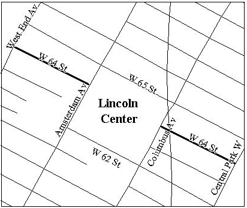
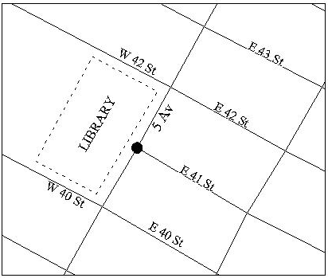

<h2>VII.3 Three-Street Configurations - Concepts and Terminology</h2>

There are many applications in which geographic locations to be processed are identified in terms of an ‘on’ street between two cross streets.  Geosupport can process several types of such locations, namely street segments, blockfaces and street stretches.  We refer generically to all these types of locations as three-street configurations.

This section introduces concepts and terminology needed to discuss three-street configurations.  The three succeeding sections discuss the Geosupport functions that process the various types of three-street configurations:

* [Chapter VII.4](/chapters/chapterVII/section04/) discusses Function 3, which processes street segments

* [Chapter VII.5](/chapters/chapterVII/section05/) discusses Function 3C, which processes blockfaces

* [Chapter VII.6](/chapters/chapterVII/section06/) discusses Function 3S, which processes street stretches.

The definitions below are based on Geosupport’s single-line map model of the city’s geography, as explained in Chapter VII.1.  Also, recall that the term ‘street’ refers to a street name or street code that satisfies the criteria delineated in Chapter VII.1.  The term ‘node’ is as defined in [Chapter VII-2](/chapters/chapterVII/section02/).

## <u>Street Stretches and Street Segments</u>

A <u>street stretch</u> is a portion (possibly all) of a street (called the <u>‘on’ street</u>) between any two nodes along it (called the <u>delimiting nodes</u> of the stretch).  A street stretch is considered to comprise both sides of the ‘on’ street.

For Geosupport purposes, <u>a street segment is defined as a street stretch between a pair of delimiting nodes which may not coincide with an intersecting street .  A street segment can therefore consist of a set of one or more CSCL segments. </u>

In Geosupport, the general term ‘street segment’ is used to describe two situations.

* A street segment is strictly defined as a street stretch such that the two delimiting nodes are consecutive along the ‘on’ street.  Every such segment is uniquely identified by a segment ID.

* For Geosupport purposes, a street segment often refers to a street stretch consisting of more than one segment, such that at least one side of the street stretch is a single entire blockface.  This street stretch is defined by multiple segments id’s, all of which may optionally be returned to the user.  For a more detailed discussion [see Chapter VII.4](/chapters/chapterVII/section04/), which describes Function 3.

Every street stretch is composed of a set of one or more street segments, which do not necessarily form a continuously connected chain.  That is, a street stretch can encompass gaps in the street.

Some examples of street stretches and segments follow.

 

Figure V11-12: Street Stretch

* The stretch of Madison Avenue between East 51st Street and East 52nd Street in Manhattan (see Figure VII-12) is a street segment.  The stretch of Madison Avenue between East 51st Street and East 54th Street is not a segment because its delimiting nodes are not consecutive along the ‘on’ street; it is a stretch consisting of three segments.

 

FigureV11-13: Street Stretch   Containing Gap

* An example of a street stretch that is not connected is Manhattan’s West 64th Street between Central Park West and West End Avenue (see Figure VII-13).  West 64th Street has a gap (does not exist) between Columbus Avenue and Amsterdam Avenue, where it is interrupted by Lincoln Center.  As a result, the stretch in question consists of two sub-stretches that are not connected to each other.

Street stretches can be delimited by pseudo-intersections and intersection names as well as conventional street intersections:

* An example of a street segment in the Bronx delimited by a dead end is CROES AVENUE between WATSON AVENUE and DEAD END (see Figure VII-3).

* An example of a street stretch in Queens delimited by the city limits is LINDEN BOULEVARD between CROSS ISLAND PARKWAY and CITY LIMITS (see Figure VII-2).

* Some examples of street segments in Manhattan delimited by bends are:  BARROW STREET between HUDSON STREET and BEND (also specifiable in terms of conventional streets as BARROW STREET between HUDSON STREET and COMMERCE STREET); and COMMERCE STREET between BARROW STREET and BEND (the only way to specify this segment) (see Figure VII-4).

## <u>Logical Direction Assigned to Streets</u>

GSS has assigned a <u>logical direction</u> to every street segment in New York City.  References to the left and right sides of any segment, and references to its delimiting nodes as the ‘from’ node and ‘to’ node, are relative to the segment’s logical direction.

For streets that have addresses, the logical direction is always assigned as the direction of increasing addresses. Therefore, for any street with addresses, the ‘from’ node of any segment is always the node at its low address end, and the ‘to’ node is the node at the high address end; the left and right sides of the segment are determined accordingly.

For features that have no addresses, such as all railroad tracks and some highways, the logical direction is assigned arbitrarily, but consistently, along the feature’s full extent.  <u>Note that a street’s logical direction, and thus the meaning of ‘from’, ‘to’, ‘left’ and ‘right’, is unrelated to the street’s traffic direction, to its orientation with respect to the points of the compass, or to the order in which cross streets delimiting a stretch are specified.</u>

## <u>Blockfaces</u>

A blockface is a continuous frontage of a physical city block along one street, ignoring the presence of any bending points or other intervening nodes.  That is, the portions of a street frontage of a block that lie on both sides of a bending point are considered to be parts of the same blockface.

FigureV11-14: Block with Four  Blockfaces

For example, the Manhattan block bounded by Madison
and Park Avenues and East 51st and East 52nd Streets has the following four blockfaces (see Figure VII-14, which, unlike most of the figures in this chapter, contains a double-line map to illustrate clearly the concept of a blockface):

* The east side of Madison Avenue between East 51st and East 52nd Streets
* The south side of East 52nd Street between Madison and Park Avenues
* The west side of Park Avenue between East 51st and   East 52nd Streets
* The north side of East 51st Street between Madison and Park Avenues

An example of a stretch with a bending point in Manhattan is Commerce Street between Bedford and Barrow Streets (see Figure VII-4).  Both sides of this stretch are single blockfaces, even though the stretch consists of two segments connected at the bending point.

## <u>T-Intersections</u>

 

Figure VII-15: T-Intersection

A street stretch, and in particular a street segment, is considered to comprise both sides of the ‘on’ street.  In the case of a street segment, each side necessarily is either a single entire blockface or a portion of one.  Many segments consist of a pair of facing entire blockfaces along the ‘on’ street.  However, this is not the case at a street configuration called a T-intersection.  A T-intersection (so named because the streets are configured like the letter ‘T’) is an intersection where a cross street intersects the ‘on’ street on one side of the ‘on’ street only, and there are no cross streets on the other side of the ‘on’ street at that intersection.  At a T-intersection, the ‘on’ street has a blockface that encompasses more than one segment, and conversely, at least one side of each of those segments consists of only a portion of that blockface.

An example of a T-intersection in Manhattan is the intersection of Fifth Avenue and East 41st Street (Figure VII-15).  Because of the presence of the New York Public Library main building along the west side of Fifth Avenue between West 40th and West 42nd Streets, there are no cross streets on the west side of Fifth Avenue where it intersects with East 41st Street.  The long blockface on the west side of Fifth Avenue encompasses two segments, each consisting of a portion of this long blockface facing a shorter entire blockface on the east side of Fifth Avenue.

 

Figure V11-16: Two Consecutive   T- Intersections 

It is possible for a street to have T-intersections at several consecutive nodes.  An example in Manhattan is the three-segment stretch of Lexington Avenue between East 42nd and East 45th Streets (Figure VII-16).  Because of the presence of the Grand Central Terminal complex on the west side of Lexington Avenue, East 43rd Street and East 44th Street intersect Lexington Avenue only on its east side, forming two consecutive T-intersections along Lexington Avenue.  As a result, the west side of this stretch is a single long blockface, which faces three shorter blockfaces on the east side of Lexington Avenue.

Figure VII-17: T-Intersections on   Alternating Sides of street 

When a street has consecutive T-intersections at which the cross streets are on alternating sides of the ‘on’ street, then long blockfaces on both sides of the ‘on’ street face each other in overlapping fashion, forming segments both sides of which consist of portions of those long blockfaces.  Union Avenue in Staten Island is an example (Figure VII-17).  Note that Union Avenue between Leyden Avenue and Walloon Street is a street segment, because the two delimiting intersections are consecutive along Union Avenue, even though the cross streets are on opposite sides of the ‘on’ street. 
  
 
 
