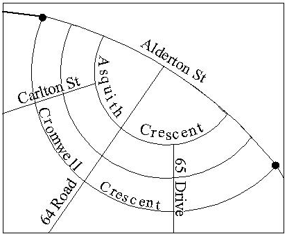

<h2>VII.4 Street Segments and Related Configurations: Function 3</h2>

Function 3 is designed to accept as input portions of a street that are, loosely speaking, ‘one block long’.  More precisely, Function 3 processes two types of input street stretches:

* Street segments (i.e., portions of a street between two consecutive nodes).
* Street stretches consisting of more than one segment, such that at least one side of the street stretch is a single entire blockface.  (Note that the user has the option of requesting that all segment ids in this type of  output stretch be returned.  See discussion of the Auxiliary Segment switch in the description of Function 3 output.)  This type of input street stretch has three sub-cases:
	* At a T-intersection, there is a street stretch in which one side is a single entire blockface.
	* At a bending point at which there are no cross streets, there is a street stretch in which both sides are single entire blockfaces.
	* Physical street segments that are split into multiple sub-segments because of a change in some district such as ZIP codes or police beats.

The following examples illustrate the types of input data acceptable and not acceptable to Function 3.  For the Lexington Avenue examples (in Manhattan), see Figure VII-16.  For the Union Avenue examples (in Staten Island), see Figure VII-17.  For the Commerce Street examples (in Manhattan), see Figure VII-4.  For the Croes Avenue example (in the Bronx), see Figure VII-3.

## 
<b>Input Data Examples for Function 3</b>

| Input ‘On’ Street | One Cross Str. | Other Cross Str. | Fn 3 Action | Reason for Action |
| :------------- | :------------- | :------------- | :------------- | :------------- |
| Lexington Avenue | East 42 Street | East 43 Street | Accepted | Single segment |
| Lexington Avenue | East 43 Street | East 44 Street | Accepted | Single segment |
| Lexington Avenue | East 44 Street | East 45 Street | Accepted | Single segment |
| Lexington Avenue | East 42 Street | East 45 Street | Accepted | Single entire blockface on west side of Lexington Ave |
| Lexington Avenue | East 42 Street | East 44 Street | Rejected | Multi-segment, neither side of Lex. Ave is a single entire blockface - west side is a portion of a blockface, east side comprises 2 blockfaces. |
| Lexington Avenue | East 43 Street | East 45 Street | Rejected | Multi-segment, neither side of Lex. Ave is a single entire blockface - west side is a portion of a blockface, east side comprises 2 blockfaces. |
| Union Avenue | Leyden Avenue | Walloon Street | Accepted | Single segment |
| Union Avenue | Walloon Street | Journey Street | Accepted | Single segment |
| Union Avenue | Journey Street | Union Court | Accepted | Single segment |
| Union Avenue | Union Court | Brabant Street | Accepted | Single segment |
| Union Avenue | Leyden Avenue | Journey Street | Accepted | Single entire blockface on west side of Union Avenue |
| Union Avenue | Walloon Street | Union Court | Accepted | Single entire blockface on east side of Union Avenue |
| Union Avenue | Journey Street | Brabant Street | Accepted | Single entire blockface on west side of Union Avenue |
| Commerce Street | Barrow Street | Bend | Accepted | Single segment |
| Commerce Street | Bedford Street | Bend | Accepted | Single segment |
| Commerce Street | Barrow Street | Bedford Street | Accepted | Both sides are single entire blockfaces |
| Croes Avenue | Watson Avenue | Dead End | Accepted | Single entire segment |

<b><u>Function 3 Input Data Specification and Validation</u></b>

Applications pass an input stretch to Function 3 by specifying three input streets, consisting of the ‘on’ street and two cross streets, in the appropriate WA1 input fields.  The input cross streets, but not the ‘on’ street, may be pseudo-streets or intersection names.  The input cross streets may be specified in either order.  As with all Geosupport street input, the three input streets to a Function 3 call are specified in the form of either street names or street codes.

If either or both of the delimiting intersections of the input stretch has more than one cross street, the stretch may be specified using any of those cross streets.  For example, the segment of Chambers Street illustrated in Figure VII-11 may be specified either as ‘Chambers Street between Church Street and West Broadway’, or as ‘Chambers Street between Church Street and Hudson Street’.

A successful two-work-area call to Function 3 signifies that the three input streets form a combination of an ‘on’ street and two cross streets that specify either a valid street segment or a valid street stretch at least one side of which is a single entire blockface.

  

FigureVII-18: Ambiguous   Segment Specification 

## <u>Ambiguous Function 3 Input Data</u>

Some combinations of an ‘on’ street and two cross streets are ambiguous as Function 3 input data, that is, the data specify more than one stretch that satisfies Function 3’s input criteria.  An example of ambiguous Function 3 input data in Queens is ‘Alderton Street between Asquith Crescent and 64th Road’ (Figure VII-18).  This combination of streets describes two different segments of Alderton Street.

Function 3 rejects such ambiguous input.  Unlike Function 2, which provides a means (compass direction input) for users to specify unambiguously an intersection of two streets that intersect in two different places, Geosupport provides the user with no recourse when Function 3 rejects an input stretch specification as ambiguous.

## <u>Function 3 Output Data</u>

If a two-work-area call to Function 3 is successful, information about both sides of the input stretch is returned in WA2.  (Note that the long WA2 option is available for the MSW Function 3.  [See Section II.5](/chapters/chapterII/section05/).)  Some of the data items apply to both the left and right sides of the segment, e.g. the ‘on’ street name and street code, segment length, ‘From’ node (COW only), ‘To’ node (COW only), etc.  Many of the data items in Function 3’s WA2 (both regular and long) are paired, with one item for the left side of the ‘on’ street and another item of the same type for the right side.  For example, there are fields for left and right ZIP code, for left and right 2010 census tract, and for left and right address ranges (each range consisting of a ‘from’ house number and a ‘to’ house number).  Other examples exist in the COW WA2 for Function 3, e.g. fields for  left and right Elections District (ED), for left and right Assembly District (AD), and for left and right Blockface ID (in COW Function 3 Extended).  As explained in [Chapter VII.3](/chapters/chapterVII/section03/), left and right are determined by the ‘on’ street’s logical direction, and therefore are independent of the order in which the user specifies the input cross streets.

In the case of an input stretch encompassing more than one segment (the T-intersection and bend cases), the values of the WA2 items that Function 3 returns for the side of the street comprising more than one blockface are as follows.  The low and high house number values that are returned correspond to the entire stretch.  The values that are returned for all other side-related items correspond to the ‘last’ (relative to the stretch’s logical direction) blockface.  For example, consider Fifth Avenue in Manhattan between East 40 and East 42 Streets (see Figure VII-15).  Since the direction of increasing addresses along Fifth Avenue is from south to north, that is also Fifth Avenue’s logical direction.  It follows that the right side of the given stretch is the east side.  It consists of two blockfaces.  Relative to the logical direction, the ‘last’ of these blockfaces is the one between East 41 and East 42 Streets.  Accordingly, the right address range that is returned in WA2, consisting of the right low house number and the right high house number, corresponds to the entire right side of Fifth Avenue between East 40 and East 42 Streets.  The values returned for all other items for the right side of the input stretch correspond to the ‘last’ blockface, the one between East 41 and East 42 Streets.  The data returned represents two segments, but only one Segment ID is capable of being returned in the regular Function 3 WA2; consequently only the Segment ID with the lowest value is returned in the regular Function 3 WA2.  COW Function 3 is capable of returning all the Segment IDs that exist in the returned segment.  (See discussion of Auxiliary Segment Switch below.)  If the user requests Fifth Avenue between East 40th street and East 41st Street, the segment ID returned will be 00034174.  If the user requests Fifth Avenue between East 41st Street and East 42nd Street, the Segment ID returned will be 00034176.  However if the user requests Fifth Avenue between East 40th Street and East 42nd Street, which represents two segments, (and the Auxiliary Segment Option is not requested) the segment ID returned will be 00034174, which is numerically the lower of the two numbers.

A COW Function 3 call may return, at the user’s option, all the Segment IDs (up to 70) of the segments that comprise the generated output segment.  To request this data, <u>the Auxiliary Segment Switch (AUXSEG a.k.a. SEGAUX)</u> in the COW WA1 must be set to ‘Y’.  This will result in all the Segment IDs (up to 70) being returned in a 500-byte area appended to the COW Function 3 WA2.

Function 3 returns the Segment Length in WA2.  This value is expressed in feet, and is computed from the Spatial Coordinates of the nodes that constitute the segment’s endpoints; it is an approximation to the true length of the segment.  <u>Segment Length values provided by Geosupport should not be used in applications that require an engineering level of precision.</u>  In the case of an input stretch encompassing more than one segment, the Segment Length value that function 3 returns is the sum of the lengths of the constituent segments.

Another item that Function 3 returns in WA2 is called the Curve Flag.  It indicates whether the input segment is curved, and if so, whether that curve is an arc of a circle or is an irregular curve.  In the case of an arc of a circle, the Curve Flag indicates on which side of the segment’s ‘secant line’ (the straight line joining the segment’s endpoint nodes) the curve lies.  If the input segment is curved, whether regularly or irregularly, the Segment Length value returned is approximately equal to the true arc length of the curve, rather than the secant length.  If the input stretch encompasses more than one segment, the Curve Flag is returned with an ‘on’ (non-blank) value if at least one of the constituent segments is curved.  For further information, see the entries for Curve Flag and Segment Length in [Appendix 3](/appendices/appendix03/).

In COW format, Function 3 also returns the FROM and TO node IDs.  In addition, in Extended COW format, Function 3 Extended (with or without Auxiliary Segments) returns  the X,Y coordinates associated with each of the nodes as well.

The <u>Extended WA2 Mode Switch</u> can be used to request the Extended COW format for Function 3.  The first 450 bytes of Function 3 with the Mode Switch set to “X” will be the same as for regular COW Function 3 calls.  The additional fields consist of items such as Bike Lane 2, Bike Traffic Direction, Street Width, X-Y Coordinates, Roadway Type, Traffic Direction and Neighborhood Tabulation Area Names.  For a full list of the data returned, see the COW Work Area layout in [Appendix 13](/appendices/appendix13/).

The <u>long WA2 option</u> is available for the MSW Function 3.  The additional data provided in the MSW long WA2 include the census geography and the administrative fire district geography.  All this data is included in the regular COW Function 3 WA2.

<b>Fuzzy Street Name Search for Functions 3 and 3C</b>
[See Section VII.8](/chapters/chapterVII/section08/) Fuzzy Street Name Search Processing for Functions 3, 3C, and 3S

## <u>Cross Street Reversal Flag</u>

A WA2 item returned by Function 3 called the Cross Street Reversal Flag indicates whether the order of the input streets is consistent with, or opposite to, the stretch’s logical direction.  This flag can be used to determine which side of the street is the left side and which side is the right side in relation to the order of the input cross streets, as follows:

* If the Cross Street Reversal Flag is returned as a blank, the cross street that was specified in the input First Cross Street field in WA1 is at the ‘from’ end of the stretch and the cross street that was specified in the Second Cross Street field is at the ‘to’ end, so that left and right are consistent with facing from the first cross street to the second cross street.
* If the Cross Street Reversal Flag contains an ‘R’, the first input cross street is at the ‘to’ end and the second is at the ‘from’ end, so that left and right are consistent with facing from the second cross street to the first cross street.

For example, consider the segment of Lexington Avenue between East 42nd and East 43rd Streets.  Since the addresses on Lexington Avenue increase from south to north, East 42nd Street is at the ‘from’ end of this segment and East 43rd Street is at the ‘to’ end.  If an application specifies this segment to Function 3 by passing East 42nd Street in the First Cross Street WA1 field and East 43rd Street in the Second Cross Street WA1 field, the Cross Street Reversal Flag will be returned as a blank.  On the other hand, if East 43rd Street is passed in the First Cross Street field and East 42nd Street is passed in the Second Cross Street field, the flag will be returned containing an ‘R’.

## <u>Segment Orientation</u>

In applications that involve field operations, such as those that generate work orders to dispatch personnel to specific blockfaces, the use of  ‘left’ and ‘right’ as descriptors of the sides of a street can cause confusion for personnel in the field, because their significance is based on the street’s logical direction, which is not necessarily obvious in the field.  Compass directions, on the other hand, are absolute descriptors of the sides of a street; the west side of Lexington Avenue in Manhattan is a specific, invariant side of that street, and is independent of how an observer may be facing.  So in such applications, compass directions may be more suitable as side-of-street descriptors than ‘left’ and ‘right’.

To determine compass direction descriptors for the left and right sides of a segment, applications can use an item called the Segment Orientation that Function 3 returns in WA2.  The Segment Orientation indicates how the input segment (or the last segment of the input stretch, if it consists of more than one segment) is oriented with respect to the points of the compass, taking into consideration the ‘on’ street’s logical direction.  For example, if the input segment is Lexington Avenue between East 42nd Street and East 43rd Street, using the Segment Orientation, the application can determine that the left side of this segment (as determined by the street’s assigned logical direction) is the west side and the right side is the east side.  See the entry for Segment Orientation in [Appendix 3](/appendices/appendix03/) for details on the possible values of the Segment Orientation and how to use it to determine compass direction descriptors for sides of streets.

In addition, in some applications it is desirable to be able to describe the ‘ends’ of a street segment in terms of a compass direction.

The application can use the Segment Orientation in conjunction with the Cross Street Reversal Flag to express a compass direction descriptor for a side of a street in terms of left or right relative to a particular ordering of the cross streets (as opposed to left and right relative to the street’s logical direction).  For example, the application can determine that, when facing from East 42nd Street to East 43rd Street, the left side of Lexington Avenue is the west side; or that, when facing from East 43rd Street to East 42nd Street, the left side of Lexington Avenue is the east side.

Applications can use the Segment Orientation and the Cross Street Reversal Flag to determine compass direction descriptors for the ‘ends’ of a street segment, as well as its sides.  For example, it can be determined that East 43rd Street is at the north end of the Lexington Avenue segment in our example, and East 42nd Street is at the south end.

See the entry for Segment Orientation in [Appendix 3](/appendices/appendix03/) for further details.

## <u>Consistent Retrieval of Application Data by ‘On’ Street and Two Cross Streets</u>

If a street stretch has a delimiting node at which there is more than one cross street, the stretch can be specified in more than one way.  Some applications require the ability to retrieve records for stretches from an application file consistently by geographic location, that is, independently of which cross streets were used to specify a stretch at record creation time and which cross streets are used at retrieval time.  Function 3 provides items that can be used to form a key for such retrieval.  Among the output items that Function 3 returns in WA2 are two lists of street codes (in the form of PB5SCs) for all the cross streets at the two delimiting nodes.  Each list is ordered so that its first entry is always the numerically smallest PB5SC of all the entries in that list.  This arrangement facilitates the formation by the application of a key for consistent geographic retrieval.  The key would consist of a combination of the PB5SC for the ‘on’ street, the first entry in the ‘from’ cross street list, and the first entry in the ‘to’ cross street list.

If the application has a need to display the street names of the cross streets, the Cross Street Names Flag in WA1 can be turned ‘on’ and the names will be returned in the List of Street Names in WA1 (see entries for Cross Street Names Flag and List of Street Names in [Appendix 3](/appendices/appendix03/)).  Note that the cross street names feature incurs processing overhead, and should only be used when necessary.

## <u>Converting Address-Keyed Application Data to ‘On’ Street/Cross Streets</u>

As mentioned in [Chapter V.5](/chapters/chapterV/section05/), Function 1’s WA2 has two lists of cross streets for the two intersections delimiting the blockface containing the input address.  Like the cross street lists in Function 3’s WA2, Function 1’s lists are arranged so that the numerically smallest PB5SC in each list is that list’s first entry.  (However, unlike Function 3’s lists, either or both of Function 1’s lists can be empty.)  Applications can identify an input address to a street stretch by using Function 1’s cross street lists to create a stretch-type key in the same way as described above for Function 3.  This is useful in some applications that process geographically heterogeneous input data, with some input records, for example, identified by an address and others by an ‘on’ street and two cross streets.  An example of such an application is the New York City Department of Transportation’s Street Light Information and Complaints System, which generates and tracks work orders for street light repair work.  Among the ways in which this application improves the efficiency of those operations is by providing a means to consolidate all transactions involving street lights located on the same street segment into a single work order, regardless of whether the initial identification of the location is by an address or by an ‘on’ street and two cross streets.
