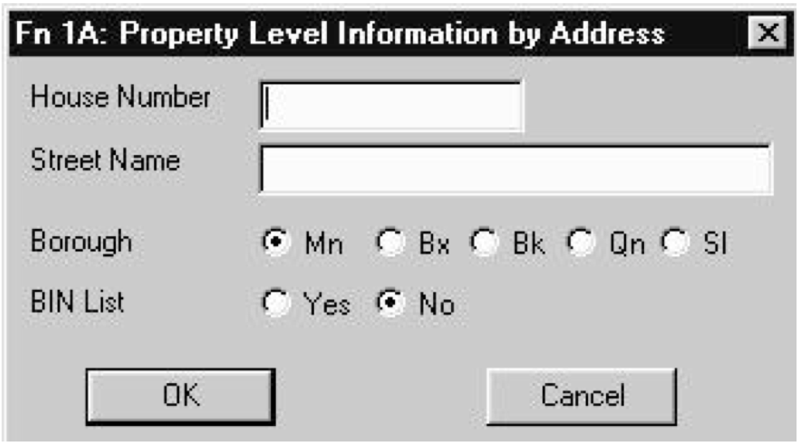
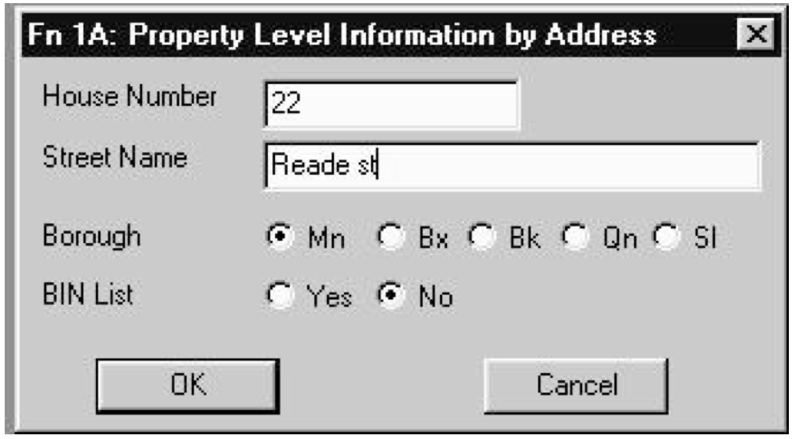
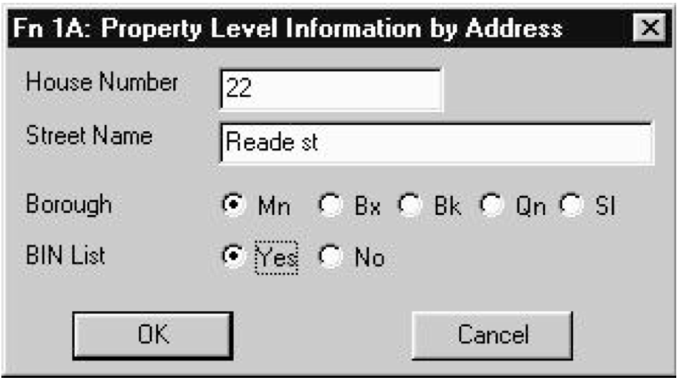
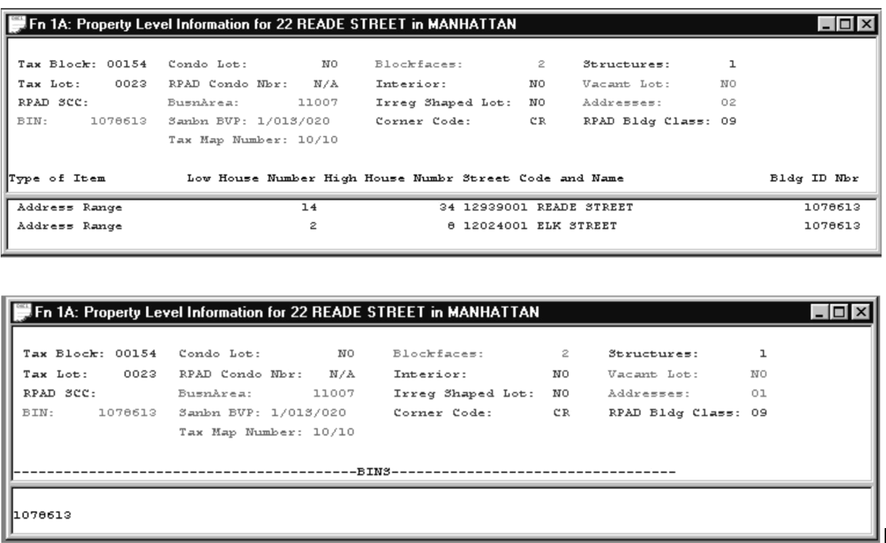

<h2> XI.4 Invoking Function 1A  </h2>

After you have clicked on the “1A” in the tool bar or the “Fn 1A” in the “Goat Function” list, the dialogue box displayed on the right will appear in your Goat Window. To invoke Function 1A you must enter a house number in the text box labeled “House Number” and a street name in the text box labeled “Street Name”.  

If you want information about a place name such as the Bronx Zoo or the Empire State Building, then you enter the place name in the text box labeled “Street Name” and leave the text box labeled “House Number” blank. You select the borough by clicking on one of the buttons associated with “Borough”. The borough names are abbreviated. Mn is Manhattan, Bx is the Bronx, Bk is Brooklyn, Qn is Queens and SI is Staten Island. The dialogue box appears with the borough pre-set to Manhattan.   

  

You may have a choice of receiving a list of addresses associated with the property or a list of Building Identification Numbers (BINs). If you leave the button associated with “BIN List” set to “No” as shown to the right, you will receive a list of addresses associated with the property.

  

The output resulting from the input illustrated on the right is as displayed below.  

   
  

 
