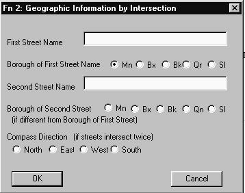
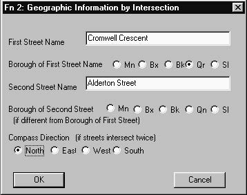
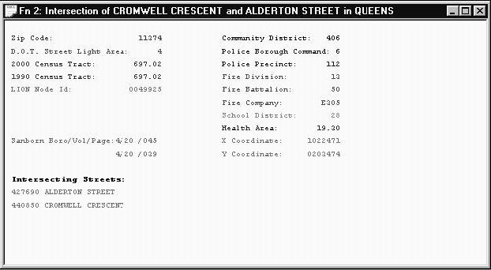

<h2> XI.5 Invoking Function 2  </h2>

   

After you have clicked on "2" in the tool bar or "Fn 2" in the “Goat Function” list, the dialogue box displayed on the right will appear in  your GOAT Window. To invoke Function 2, you must enter two street names. The first goes in the text box labeled “First Street Name” and the second goes in the text box labeled “Second Street Name”. Place Names may not be used. You select the borough by clicking on one of the buttons associated with “Borough of First Street Name”. The borough names are abbreviated. Mn is Manhattan, Bx is the Bronx, Bk is Brooklyn, Qn is Queens and SI is Staten Island. The dialogue box appears with the borough pre-set to Manhattan. You do not need to click on a button associated with “Borough of Second Street” if both streets are in the same borough.  

  

There are certain streets in New York City which intersect twice. One example is Cromwell Crescent and Alderton Street in Queens. To obtain information about the intersection you must specify about which one of the two intersections you want the information. This is done by specifying a compass direction as illustrated in the dialogue box to the right. The output resulting from this input is shown below.  
 

  
