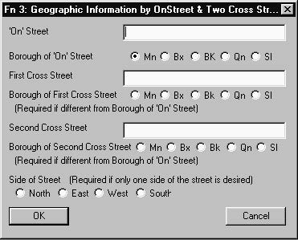
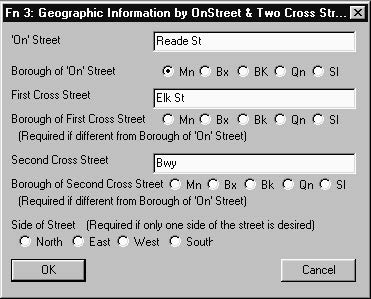
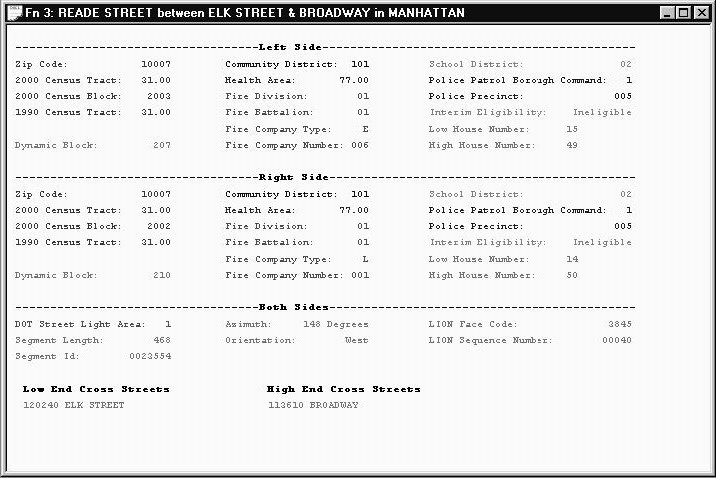
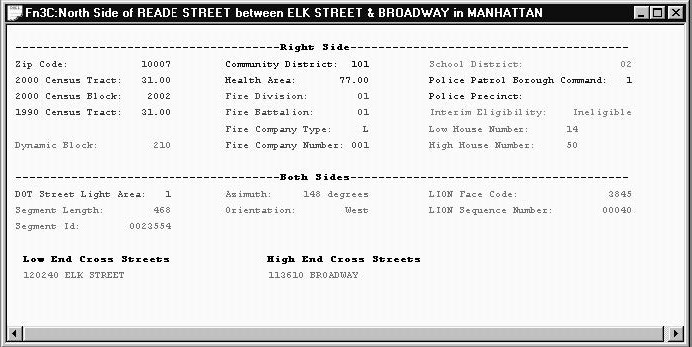

<h2> XI.6 Invoking Function 3 or Function 3C  </h2>

After you have clicked on "3" in the tool bar or "Fn 3"   in the “Goat Function” list, the dialogue box displayed on the right will appear in your GOAT Window. To invoke Function 3 or 3C, you must enter three street names. The first goes in the text box labeled “‘On’ Street”, the second goes in the text box labeled “First Cross Street” and the third goes in the text box labeled “Second Cross Street”. Place Names may not be used. You select the borough by clicking on one of the buttons associated with “Borough of 'On' Street Name”. The borough names are abbreviated. Mn is Manhattan, Bx is the Bronx, Bk is Brooklyn, Qn is Queens and SI is Staten Island. The dialogue box appears with the borough pre-set to Manhattan. You do not need to click on a button associated with “Borough of First Cross Street” or “Borough of Second Cross Street” if all three streets are in the same borough.  

The dialogue box above will result in the output illustrated as shown below.  

  

If you want information about only one side  of the street (Function 3C), then you use the compass direction found towards the bottom of the dialogue box to select the side of the street that you are interested in.

This is illustrated in the dialogue box displayed above. The output resulting from this input is shown below.  

