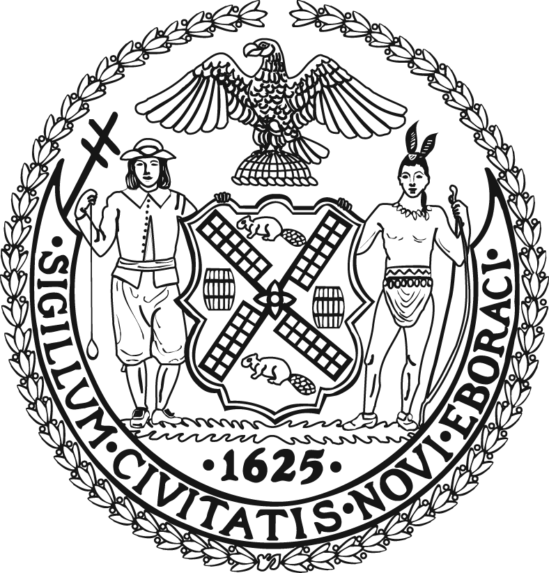

**CITY OF NEW YORK**  
Bill de Blasio, Mayor  

   
**DEPARTMENT OF CITY PLANNING**  
Marisa Lago, Director  
Purnima Kapur, Executive Director  
Jon Kaufman, Chief Operating Officer  

   
**INFORMATION TECHNOLOGY DIVISION**  
Hassan Adekoya, Chief Information Officer   

   
**GEOGRAPHIC SYSTEMS SECTION**  
Rudy Lopez, Director  
Michele McInnes, AICP, Deputy Director  
Nilesh Palve, Programming Manager and Solution Architect  
Thomas Costa, AICP, Manager, Geographic Research  
Rodrigo Zapata, Deputy Manager, Geographic Research  

   
**PROGRAMMING STAFF**  
Frank Chin  
Jie Ding  
Gloria Katz  
Yoel Lebel  
Steve Oliver  
Jigar Talati  
Jasmine Tse  
Tatyana Vechnyak

   
The Geosupport logo is a trademark of the Department of City Planning / City of New York.  
Geosupport Desktop Edition is a trademark of the Department of City Planning / City of New York

Windows is a registered trademark of Microsoft Corporation in the United States and/or other countries.

Other product and company names mentioned herein may be the trademarks or registered trademarks of their respective owners.
